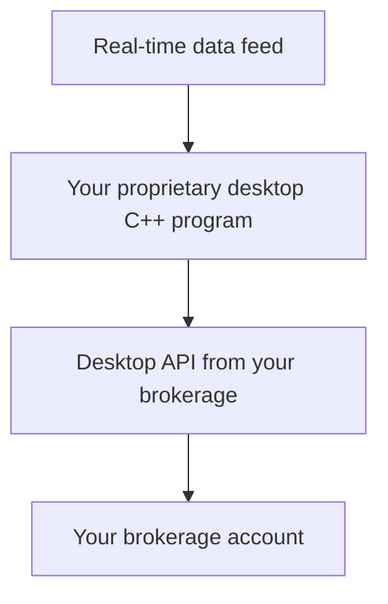

# Book Summary

### Bias in Quant Trading

- *Survivorship bias* → indices had stocks that became unlisted (Enron, Lehmann, etc.).

- *Data-snooping bias* → Most rules = more likely to suffer data-snooping bias. Minimize it in Chapter 3. Very hard to avoid.

## How to Identify a Strategy That Suits You (Screening Criteria)

Finding prospective quantitative trading strategies:

- Business school and other economic research websites.

- Financial websites and blogs focusing on the retail investors.

- Trader forums where you can exchange ideas with fellow traders.

- Twitter

- Medium

- Discord servers

 

The strategy should fit your own circumstances:

- ***How much time do you have? →*** > part-time realistically, fully automate it so I can run it on autopilot all the time and alert me only when problems occur, or only require me to put in orders.

- ***How good a programmer are you? ***→ Beginner at Python, but I can leverage language models to help create code.

- ***How much trading capital do you have?*** → consider instrument and strategy with capital constraint in mind. Indirect constraints include infrastructure, data and software.

- ***What is your goal?*** → Steady monthly income or long-time capital gain? Aim to achieve the maximum Sharpe ratio (minimum of 1)

### Costs

*Consider the costs when trading (buy and sell side, funding fees, etc.)*

- Transaction costs → the more frequent, the larger the impact of transaction costs on the profitability of the strategy.

- Market impact (orderbook depth) → if the asset’s depth is shallow (taker)

- Slippage due to a delay in execution 

 

### Strategy Selection Checklist

*Before doing an in-depth backtest of the strategy, filter out some unsuitable strategies if they fail one or more of the following tests:*

- [ ] Does it outperform a benchmark?

- [ ] Does it have a high enough Sharpe ratio?

- [ ] Does it have a small enough drawdown and short enough drawdown duration?

- [ ] Does the backtest suffer from survivorship bias?

- [ ] Does the strategy lose steam in recent years compared to its earlier years?

- [ ] Does the strategy have its own “niche” that protects it from intense competition from large institutional money managers?

*After these quick judgements, you can proceed to backtest it rigorously to make sure the strategy does what it is advertised to do.*

 

## Rigorous Backtesting

Backtesting gives you a realistic historical simulation of the performance of a strategy. The hope is that the future performance of the strategy will resemble its past performance, but this is not guaranteed.

Issues include:

- ***Data: ***Split/dividend adjustments, noise in daily OHLC, and survivorship bias.

- ***Performance measurement: ***Annualized Sharpe ratio and maximum drawdown.

- ***Look-ahead bias:*** Using unobtainable future information for past trading decisions

- ***Data-snooping bias: ***Using too many parameters to fit historical data, tweaking a strategy too many times in backtest, and avoiding it using a large enough sample, out-of-sample testing, and sensitivity analysis.

- ***Transaction cost: ***Impact of transaction costs on performance.

- ***Strategy refinement:*** Common ways to make small variations on the strategy to optimize performance.

 

Once backtested with reasonable performance (> 1 Sharpe ratio), you are ready to take the next step in setting up your trading business.

 

## Setting Up Your Business

Bridging the research phase and the execution phase of your trading business. Retail trading vs proprietary trading:

- Retail brokerages give you complete freedom and better capital protection but smaller leverage

- Proprietary trading firms give you less freedom and less capital protection but much higher leverage

*Research which brokerage suits your needs and has the following features:*

- [ ] Relatively low commissions

- [ ] Trade a good variety of instruments

- [ ] Access to deep pool of liquidity

- [ ] API for real-time data retrieval and order transmission (CCXT for crypto)

 

*Components of a trader’s operating environment:*

- [ ] Personal computer

- [ ] High-speed internet connection

- [ ] Non-interruptible power supply

- [ ] Real-time data and new feed and subscription to financial TV new channels

- [ ] VPS

One you have considered and taken these steps, you are now positioned to build an automated trading environment to execute your strategy.

## Execution Systems

Checklist to move to this point:

- [ ] Backtested a good strategy

- [ ] Picked a brokerage

- [ ] Set up a good operating environment

 

### Building a Fully Automated Trading System

 

**3 advantages to having this software:**

- It ensures the faithful adherence to your backtested strategy.

- It eliminates manual operation so that you can simultaneously run multiple strategies

- Most importantly, it allows speedy transmissions of orders, which is essential to high-frequency trading strategies.

*Regarding the difference between a semiautomated trading system and a fully automated trading system:*

- In a semiautomated trading system, the trader still needs to manually upload a text file containing order details to a basket trader or spread trader, and manually press a button to transmit the orders at the appropriate time.

- In a fully automated trading system, the program will be able to automatically upload data and transmit orders throughout the trading day or even over many days.

 

After creating your ATS, focus on** minimizing transaction costs** (not allowing your size be too relative to its average trading volume and relative to its market capitalization) and **paper trading** which allows you to:

- Discover software bugs in your trading strategy and execution programs.

- Discover look-ahead or even data-snooping bias.

- Discover operating difficulties and plan for operating schedules.

- Estimate transaction costs more realistically.

- Gain important intuition about P&L volatility, capital usage, portfolio size, and trade frequency.

 

What happens if the live-trading underperforms your backrest?

- Eliminate bugs in the strategy or execution software

- Reduce transaction costs

- Simplify the strategy by eliminating parameters

## Money and Risk Management

Most losses are due to overleveraging positions and not to an inherently erroneous model. Typically, previously superbly performing models are at the greatest risk of hug loss due to overconfidence and overleverage.

Use the **Kelly formula** to determine the optimal leverage:

$$ f_i=m_i/S^2_i $$

*Where *$ m_i $* = mean annual return, and *$ S_i^2 $* = Sharpe ratio.*

 

- Besides the determination of the optimal leverage, the Kelly formula has a very useful side benefit: It also determines the optimal allocation of capital among different strategies, based on the covariance of their returns.

- The ultimate risk management mind-set is very simple: Do not succumb to either despair or greed. To gain practice in this psychological discipline, one must proceed slowly with small position size, and thoroughly test various aspects of the trading business (model, software, operational procedure, money and risk management) before scaling up according to the Kelly formula.

- I have found that in order to proceed slowly and cautiously, it is helpful to have other sources of income or other businesses to help sustain yourself either financially or emotionally (to avoid the boredom associated with slow progress). It is indeed possible that finding a diversion, whether income producing or not, may actually help improve the long-term growth of your wealth.

You can also get the annualized compounded, levered growth rate:

$$ g=r_f+S^2/2 $$

*Where *$ r_f $* = risk-free rate, and *$ S_i^2 $* = Sharpe ratio.*

## Special Topics in Quant Trading

First 6 chapters were about the basic knowledge to research, develop and execute your own quantitative strategy. 

This book is largely about a type of quant trading called *statistical arbitrage* in the investment industry. It is far simpler than trading derivatives or fixed-income instruments, both conceptually and mathematically. A large part of the statistical arbitrageur’s standard arsenal include: mean reversion and momentum, regime switching, stationarity and cointegration, arbitrage pricing theory or factor model, season trading models, and high-frequency trading.

Some of the important points to note can be summarized here:

- **Mean-reverting regimes** are **more prevalent** than trending regimes.

- There are some tricky data issues involved with backtesting mean-reversion strategies: Outlier quotes and survivorship bias are among them.

- **Trending regimes** are usually triggered by the diffusion of new information, the execution of a large institutional order, or “herding” behavior.

- Competition between traders tends to reduce the number of mean-reverting trading opportunities.

- Competition between traders tends to reduce the optimal holding period of a momentum trade.

- Trading parameters for each day or even each trade can be optimized using a machine-learning-based method we called CPO.

- A stationary price series is ideal for a mean-reversion trade.

- Two or more nonstationary price series can be combined to form a stationary one if they are “cointegrating.”

- Cointegration and correlation are different things: Cointegration is about the long-term behavior of the prices of two or more stocks, while correlation is about the short-term behavior of their returns.

- Factor models, or arbitrage pricing theory, are commonly used for modeling how fundamental factors affect stock returns linearly.
Special Topics in Quantitative Trading 191

- One of the most well-known factor models is the **Fama-French Three-Factor model**, which postulates that stock returns are proportional to their beta and book-to-price ratio, and negatively to their market capitalizations.

- Factor models typically have a relatively long holding period and long drawdowns due to regime switches.

- Exit signals should be created differently for mean-reversion versus momentum strategies.

- Estimation of the optimal holding period of a mean-reverting strategy can be quite robust, due to the Ornstein-Uhlenbeck formula.

- Estimation of the optimal holding period of a momentum strategy can be error prone due to the small number of signals.

- Stop loss can be suitable for momentum strategies but not reversal strategies.

- **Seasonal trading** strategies for stocks (i.e., calendar effect) have become unprofitable in recent years.

- Seasonal trading strategies for commodity futures continue to be profitable.

- High-frequency trading strategies rely on the “law of large numbers” for their high Sharpe ratios.

- High-frequency trading strategies typically generate the highest long-term compounded growth due to their high Sharpe ratios.

- High-frequency trading strategies are very difficult to backtest and very technology-reliant for their execution.

- Holding a highly leveraged portfolio of low-beta stocks should generate higher long-term compounded growth than holding an unleveraged portfolio of high-beta stocks.

💡 Most statistical arbitrage trading strategies are some combination of these effects or models: Whether they are profitable or not is more of an issue of where and when to apply them than whether they are theoretically correct.

